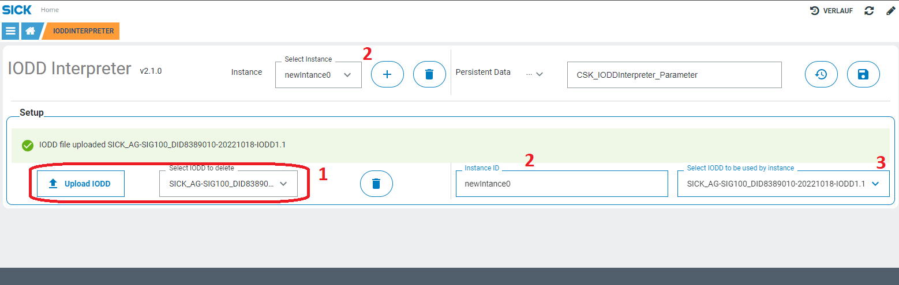
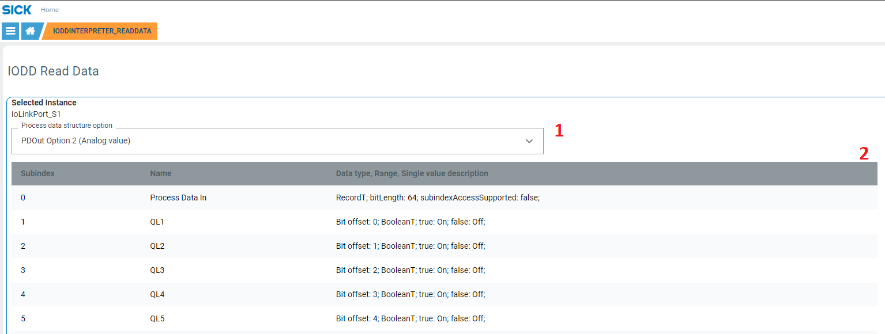
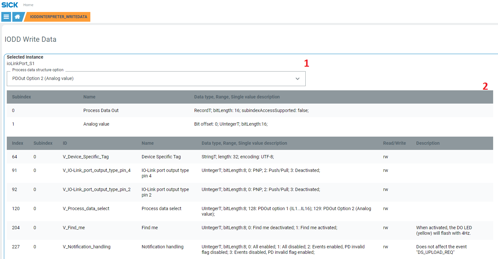

# CSK_Module_IODDInterpreter

Module to interpret IO-Link IODD files for further use by CSK_Module_MultiIOLinkSMI, CSK_Module_MultiIOLinkRestMaster or for your customized app.
For further information check out the [documentation](https://raw.githack.com/SICKAppSpaceCodingStarterKit/CSK_Module_IODDInterpreter/main/docu/CSK_Module_IODDInterpreter.html) in the folder "docu".

## How to Run
This application is developed mostly to be used by other applications that require IO-Link data interpretation based on IODD files.
Also the app includes an intuitive GUI to setup and interpret IODD files.  

### Main page
1. IODD handling files area: uploade new XML files or delete the selected file.
2. Instance handling area: create instance, select current instance, rename or delete it.
3. Select IODD file to be used by the selected instance. This will load read and write data tables accordingly.

### Read data page
1. Select the process data structure option if it is variable.
2. Dynamic tables representing process data IN and parameters available for the selected IODD file with read only or read/write access.

### Write data page
1. Select the process data structure option if it is variable.
2. Dynamic tables representing process data OUT and parameters available for the selected IODD file with write only or read/write access.

## Dependencies

Following CSK modules are mostly necessary to make use of the features of this module:
|Module|Version|Remark
|--|--|--|
|CSK_1stModule_Logger|[V4.0.0](https://github.com/SICKAppSpaceCodingStarterKit/CSK_1stModule_Logger/releases/tag/v4.0.0)|Optional
|CSK_Module_PersistentData|[V4.0.0](https://github.com/SICKAppSpaceCodingStarterKit/CSK_Module_PersistentData)|To persist data

## Known issues

### Open Todo
- Multiple languages support.

## Information

Tested on  

|Device|Firmware version|Module version|
|--|--|--|
|SICK AppEngine|V1.7.0|V1.1.0|
|SIM1012|V2.4.2|V1.1.0|
|SIM1012|v2.3.0|v1.0.1|
|SIM1012|v2.3.0|v1.0.0|
|SIM1012|v2.4.1|v1.0.1|
|SIM1012|v2.4.1|v1.0.0|

This module is part of the SICK AppSpace Coding Starter Kit developing approach.  
It is programmed in an object-oriented way. Some of the modules use kind of "classes" in Lua to make it possible to reuse code / classes in other projects.  
In general, it is not neccessary to code this way, but the architecture of this app can serve as a sample to be used especially for bigger projects and to make it easier to share code.  
Please check the [documentation](https://github.com/SICKAppSpaceCodingStarterKit/.github/blob/main/docu/SICKAppSpaceCodingStarterKit_Documentation.md) of CSK for further information.  

## Topics

Coding Starter Kit, CSK, Module, SICK-AppSpace, IO-Link, IODD
